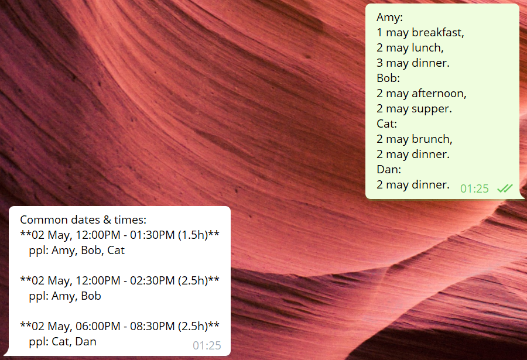

# eventboybot
This bot aims to meet your event planning needs. We plan to make this bot a one-stop event planning companion.
We are now in v1 where the bot can compute common timeslots (labelled w names) given a list of available timeslots (that are labelled w names).

Trying to find a common time for a meeting? But everyone's schedule is so different? Let our bot do it automatically for you!
!")

This bot was created using [Bot Framework](https://dev.botframework.com).

## Running the bot locally
- Run `pip install -r requirements.txt` to install dependencies
- Run `python app.py`
- Now, the bot is running on localhost:3978

## Testing the bot using Bot Framework Emulator
[Bot Framework Emulator](https://github.com/microsoft/botframework-emulator) is a desktop application that allows bot developers to test and debug their bots on localhost or running remotely through a tunnel.

- Install the Bot Framework Emulator version 4.3.0 or greater from [here](https://github.com/Microsoft/BotFramework-Emulator/releases)

### Connect to the bot using Bot Framework Emulator

- Launch Bot Framework Emulator
- Enter a Bot URL of `http://localhost:3978/api/messages`

## Deploying the bot on Azure
- [deploying on azure](https://docs.microsoft.com/en-us/azure/bot-service/bot-builder-deploy-az-cli?view=azure-bot-service-4.0&tabs=csharp)
- Contributors need only be concerned with making pull requests to this repo. The core team of makimakers will manage the deployment of the bot on Azure.

## Workflow
As a best practice, no pushing is allowed to the master branch, please `git config branch.master.pushRemote no_push` in your local repo.
Any commits to master must be merged via a pull request. Pushing to non-master branches will be allowed if you're an authorized contributor. 

## More Resources

- [Bot Framework Documentation](https://docs.botframework.com)
- [Bot Basics](https://docs.microsoft.com/azure/bot-service/bot-builder-basics?view=azure-bot-service-4.0)
- [Dialogs](https://docs.microsoft.com/azure/bot-service/bot-builder-concept-dialog?view=azure-bot-service-4.0)
- [Gathering Input Using Prompts](https://docs.microsoft.com/azure/bot-service/bot-builder-prompts?view=azure-bot-service-4.0&tabs=csharp)
- [Activity processing](https://docs.microsoft.com/en-us/azure/bot-service/bot-builder-concept-activity-processing?view=azure-bot-service-4.0)
- [Azure Bot Service Introduction](https://docs.microsoft.com/azure/bot-service/bot-service-overview-introduction?view=azure-bot-service-4.0)
- [Azure Bot Service Documentation](https://docs.microsoft.com/azure/bot-service/?view=azure-bot-service-4.0)
- [Azure CLI](https://docs.microsoft.com/cli/azure/?view=azure-cli-latest)
- [Azure Portal](https://portal.azure.com)
- [Language Understanding using LUIS](https://docs.microsoft.com/azure/cognitive-services/luis/)
- [Channels and Bot Connector Service](https://docs.microsoft.com/azure/bot-service/bot-concepts?view=azure-bot-service-4.0)
